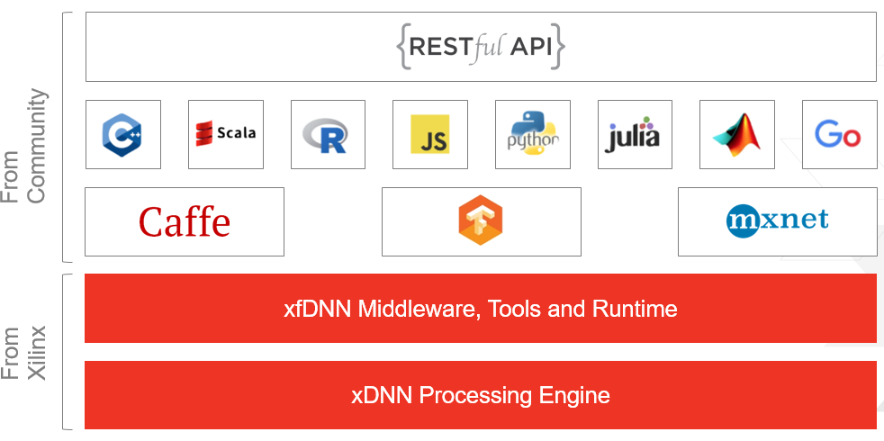

<table style="width:100%">
<tr>
<th width="100%" colspan="6"><h1>Xilinx ML Suite v1.3</h2>
</th>
</table>
  

The Xilinx Machine Learning (ML) Suite provides users with the tools to develop and deploy Machine Learning applications for Real-time Inference. It provides support for many common machine learning frameworks such as Caffe, Tensorflow, and MXNet.  

The ML Suite is composed of three basic parts:
1. **xDNN IP** - High Performance general CNN processing engine.
2. **xfDNN Middleware** - Software Library and Tools to Interface with ML Frameworks and optimize them for Real-time Inference.
3. **ML Framework and Open Source Support**  - Support for high level ML Frameworks and other open source projects.

**Learn More:** [ML Suite Overview][]  
**Watch:** [Webinar on Xilinx FPGA Accelerated Inference][]   
**Forum:** [ML Suite Forum][]

## [See What's New](docs/release-notes/1.x.md)
 - [Release Notes][]
 
## Getting Started
1. Clone ML Suite    
  `git clone https://github.com/Xilinx/ml-suite.git` 
2. Download Overlays and Pre-Trained Models from [ML Suite Lounge][]
   - Overlays: Download and unzip desired overlays into the `ml-suite/overlaybins/` dir, for example: `ml-suite/overlaybins/alveo-u200`
   - Pre-Trained Models: Download and unzip to the `/ml-suite/` dir. 
3. [Install Anaconda2][]
   - Note: Ensure that you ran the `fix_caffe_opencv_symlink.sh` script  

   
## References 
- [ML Suite Overview][]  
- User Guides:
  - [Compiler Python API](docs/tutorials/api-xfdnncompile.md)
  - [Quantizer Python API](docs/tutorials/api-xfdnnquantize.md)
  - [xfDNN Python API](docs/tutorials/api-xfdnnruntime.md)
- Tutorials and Examples:
  - [Jupyter Notebooks](notebooks/)
  - [Precompiled Examples](examples/classification/README.md)  

## Recommended System Requirements
- OS: Ubuntu 16.04.2 LTS, Ubuntu 18.04 LTS, CentOS 7.4
- CPU: 6 Cores (Intel/AMD/Power9)
- Memory: 8 GB

## Supported Platforms
Cloud Services
 - [Amazon AWS EC2 F1][]
 - [Nimbix](https://www.nimbix.net/xilinx/)

 On Premise Platforms (Visit [ML Suite Lounge] for Details)
  - Alveo U200 Data Center Accelerator Card
  - Alveo U250 Data Center Accelerator Card
  - Xilinx Virtex UltraScale+ FPGA VCU1525 Acceleration Development Kit

## Release Notes
 - [Release Notes][]

## Questions and Support

- [FAQ][]
- [AWS F1 Application Execution on Xilinx Virtex UltraScale Devices][]
- [ML Suite Forum][]
- [Performance Whitepaper][]

[install Anaconda2]: docs/tutorials/anaconda.md
[models]: docs/tutorials/models.md
[Amazon AWS EC2 F1]: https://aws.amazon.com/marketplace/pp/B077FM2JNS
[Xilinx Virtex UltraScale+ FPGA VCU1525 Acceleration Development Kit]: https://www.xilinx.com/products/boards-and-kits/vcu1525-a.html
[AWS F1 Application Execution on Xilinx Virtex UltraScale Devices]: https://github.com/aws/aws-fpga/blob/master/SDAccel/README.md
[SDAccel Forums]: https://forums.xilinx.com/t5/SDAccel/bd-p/SDx
[Tutorials]: docs/tutorials/README.md
[Release Notes]: docs/release-notes/1.x.md
[UG1023]: https://www.xilinx.com/support/documentation/sw_manuals/xilinx2017_4/ug1023-sdaccel-user-guide.pdf
[FAQ]: docs/tutorials/faq.md
[ML Suite Overview]: docs/tutorials/ml-suite-overview.md
[Webinar on Xilinx FPGA Accelerated Inference]: https://event.on24.com/wcc/r/1625401/2D3B69878E21E0A3DA63B4CDB5531C23?partnerref=Mlsuite
[ML Suite Forum]: https://forums.xilinx.com/t5/Xilinx-ML-Suite/bd-p/ML 
[ML Suite Lounge]: https://www.xilinx.com/products/boards-and-kits/alveo/applications/xilinx-machine-learning-suite.html
[Models]: https://www.xilinx.com/products/boards-and-kits/alveo/applications/xilinx-machine-learning-suite.html#gettingStartedCloud
[whitepaper here]: https://www.xilinx.com/support/documentation/white_papers/wp504-accel-dnns.pdf
[Performance Whitepaper]: https://www.xilinx.com/support/documentation/white_papers/wp504-accel-dnns.pdf
